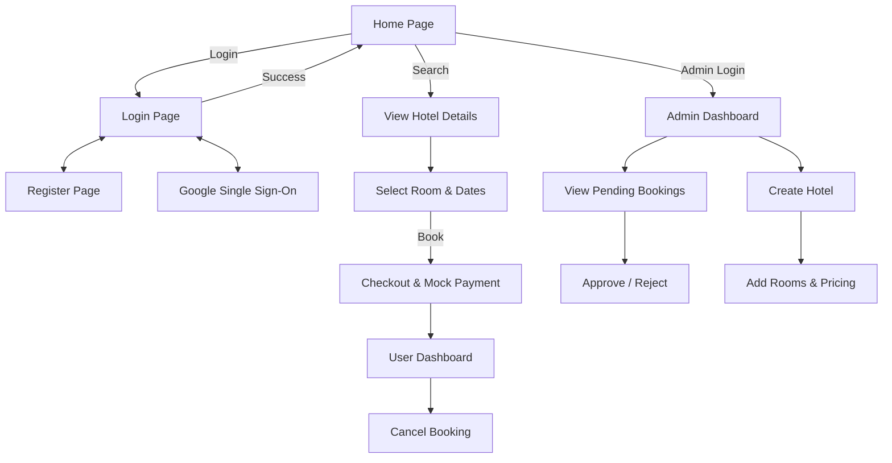
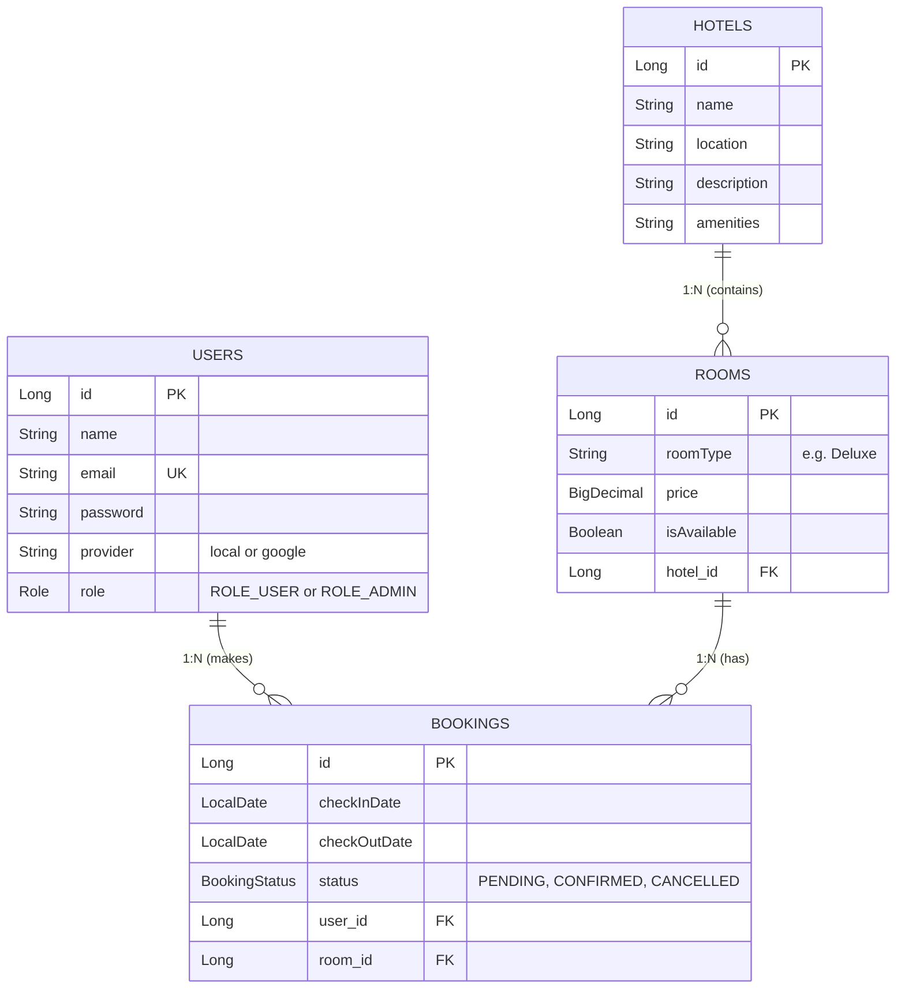

# 🏨 Premium Indian Hotel Booking System

A state-of-the-art, fully featured, and localized full-stack Hotel Booking Application customized for the Indian market. Built with **Spring Boot** (Java 17) on the backend, **React.js** (Vite) on the frontend, and secured with **JWT Authentication** and **OAuth2 (Google Sign-In)**. 

Featuring interactive admin controls for dynamic hotel/room management, a beautiful user checkout flow, and premium transaction-level HTML notifications powered by the **Brevo HTTP API**.

---

## 🌟 Key Features

### 🇮🇳 Indian Localization
- **Local Currencies**: Standardized to use the Indian Rupee (**₹**) globally.
- **Pre-Seeded Luxury Properties**: Seeded with 8 real-world Indian hospitality giants such as *The Taj Mahal Palace (Mumbai)*, *Taj Falaknuma Palace (Hyderabad)*, and *Novotel Varun (Vijayawada)*.

### 🔑 Security & Authentication
- **Secure JWT Flow**: Custom stateless token-based authentication.
- **Google OAuth2 Support**: Ready-to-go Google Single Sign-On integration.
- **Role-Based Access**: Strict separation between Standard Users and System Administrators.

### 👑 Premium Admin Console
- **Interactive Dashboard**: Effortlessly switch between booking approval/rejection and hotel management.
- **Dynamic Hotel Creation**: Easily register new luxury properties with descriptions, custom locations, and amenity tags.
- **Dynamic Room Management**: Add multiple room classes with custom rates dynamically.

### 💳 Interactive Mock Checkout
- **Real-Time Calculation**: Dynamically calculates the total price based on room rates and the selected Check-In/Check-Out duration.
- **Payment Gateway UI**: Forces users to enter billing and mock card details before a booking is confirmed, simulating a real enterprise application.

### ✉️ Beautiful Transactional Email Notifications
- Fully integrated with the **Brevo REST API** to bypass SMTP blocks.
- Delivers premium, visual-heavy HTML-styled email templates for **Registration**, **Booking Confirmed**, and **Booking Cancellation**.

---

## 🗺️ System Architecture Flow

### High-Level User Navigation


---

## 💾 Database Schema (ER Diagram)

The system uses a relational PostgreSQL database with the following core entities:



---

## 🛠️ Technology Stack

| Component | Technology |
| :--- | :--- |
| **Backend** | Spring Boot, JPA/Hibernate, Spring Security (JWT + OAuth2), PostgreSQL |
| **Frontend** | React (Vite), Context API, Axios, Lucide React Icons |
| **Integrations** | Brevo HTTP REST API (for transaction emails), Google Client Sign-In |
| **Dev Security** | Spring Config Native `.env` Loader, Maven, `.gitignore` |

---

## 🚀 Getting Started

### Prerequisites
- **Java 17+**
- **Node.js (v18+)**
- **PostgreSQL Database**

### 1. Backend Setup

1. **Clone the repository** and navigate to the backend:
   ```bash
   cd backend
   ```

2. **Configure Environment Variables**:
   Create a file named `.env` in the root of the `backend` folder and add your credentials:
   ```env
   JWT_SECRET=your_super_long_custom_jwt_secret_key
   BREVO_API_KEY=your_brevo_xkeysib_api_key
   BREVO_SMTP_USERNAME=your_brevo_smtp_username
   BREVO_SMTP_PASSWORD=your_brevo_smtp_password
   GOOGLE_CLIENT_ID=your_google_client_id
   GOOGLE_CLIENT_SECRET=your_google_client_secret
   ```

3. **Run the Backend Application**:
   ```bash
   mvn spring-boot:run
   ```
   *The backend will automatically start up on `http://localhost:8080`.*

### 2. Frontend Setup

1. Navigate to the frontend directory:
   ```bash
   cd ../frontend
   ```

2. **Install Dependencies**:
   ```bash
   npm install
   ```

3. **Launch Vite Development Server**:
   ```bash
   npm run dev
   ```
   *The frontend application will be active at `http://localhost:5173`.*

---

## 📂 Project Architecture

```text
HotelBooking/
├── backend/
│   ├── src/main/java/com/demo/HotelBooking/
│   │   ├── config/          # CORS, Data Seed configurations
│   │   ├── controller/      # Auth, Hotel, & Booking Endpoints
│   │   ├── dto/             # Request & Response Payload DTOs
│   │   ├── model/           # JPA Entities (Hotel, Room, Booking, User)
│   │   ├── repository/      # Spring Data JPA Repository interfaces
│   │   ├── security/        # JWT Filtering, UserDetails, WebSecurity
│   │   └── service/         # Email, Hotel, Booking core services
│   ├── .env                 # (Ignored) Secure environment credentials
│   └── pom.xml              # Maven dependencies
└── frontend/
    ├── src/
    │   ├── components/      # Reusable UI elements (Navbar, Footer)
    │   ├── context/         # React Context (AuthContext)
    │   ├── pages/           # Pages (Home, Detail, Dashboard, Admin)
    │   └── utils/           # Axios interceptors & custom API routing
```

---
